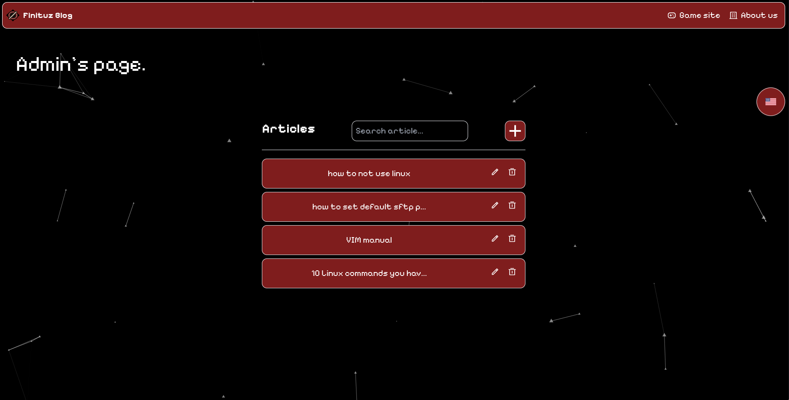
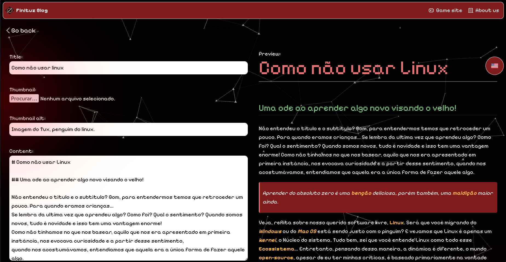

# Finituz.com server-side

This backend was made for serving Finituz Blog.
It translate the article created in admin frontend from pt-br to en, it also permit to manage the articles, upload, delete, update and get metadata.

## How does it work?

We use [LibreTranslate](https://github.com/LibreTranslate/LibreTranslate?tab=readme-ov-file) in a docker container for serving the translation.
The backend is build in , its a very simple API actually!

You can read the code for more information!

